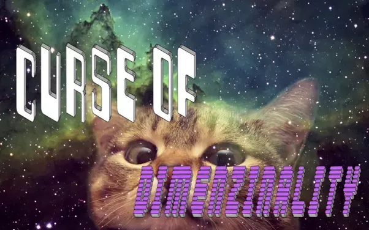

## Hey there! 👋
 

- 💡 I'm a second year Masters student at NYU, studying Computer Engineering currently working at EMERGE Lab.

- 🤖 Currently working in Reinforcement Learning, Multimodality, multilingualism, and contrastive learning.

- 🔬 Check out some of the projects of [IvLabs](https://www.ivlabs.in/) the Robotics and AI club of VNIT of which I was a part of.
 

**Contact me:**

 

